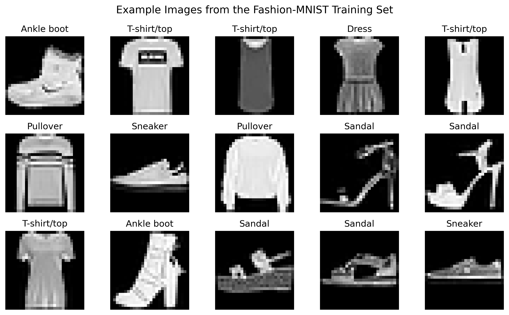
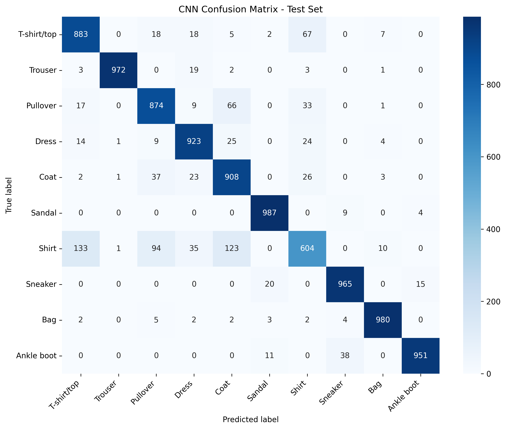
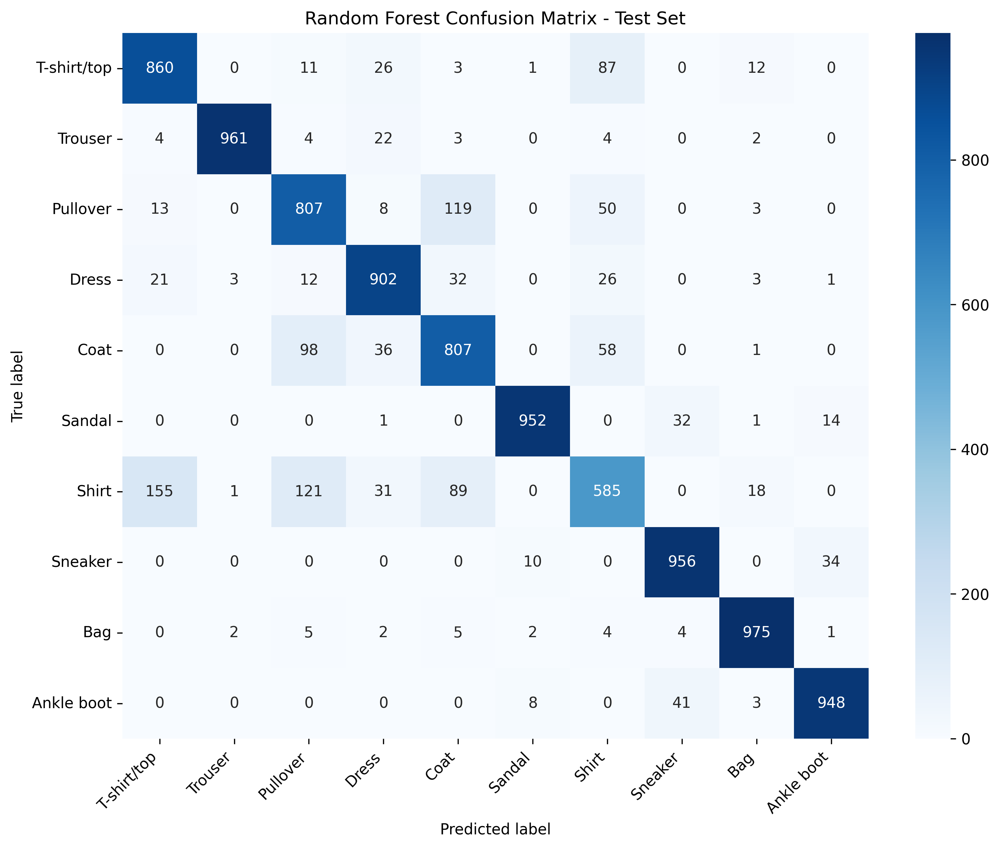
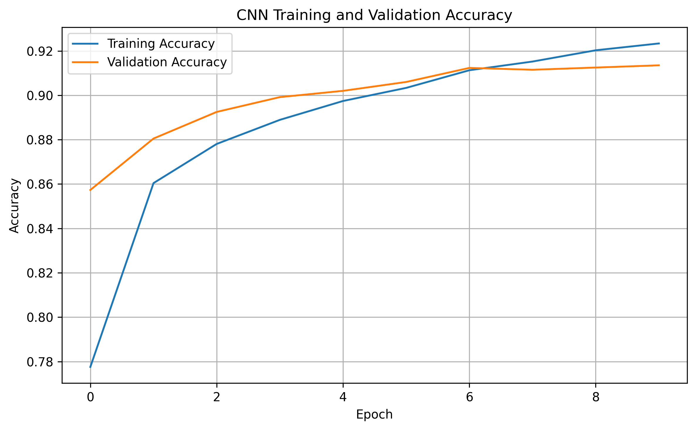

# Fashion-MNIST Image Classification Using CNN and Random Forest

This project compares two machine learning approaches for fashion image classification using the Fashion-MNIST dataset. A Convolutional Neural Network (CNN) and a Random Forest classifier were implemented and evaluated using accuracy, precision, recall, confusion matrices, and training time.

## Project Overview

This project compares two machine learning approaches for classifying fashion product images from the Fashion-MNIST dataset:

1. Convolutional Neural Network (CNN)
2. Random Forest Classifier

The project was developed for **DLBAIPCV01 – Project: Computer Vision, Task 2: Classifying Fashion Products**. The objective is to evaluate both models using accuracy, training time, confusion matrices, precision, recall, and worst-performing class analysis.

## Research Question

Which classifier provides the best balance between predictive performance and computational efficiency for automated fashion-product classification: a Convolutional Neural Network or a Random Forest classifier?

## Notebook

The complete implementation, training process, and evaluation results are available in:

[Fashion_MNIST_Task2_Project.ipynb](Fashion_MNIST_Task2_Project.ipynb)

## Dataset

The project uses the Fashion-MNIST benchmark dataset introduced by Zalando Research. It contains 70,000 grayscale images of fashion products divided into 10 classes.

The dataset consists of:

- 60,000 training images
- 10,000 test images
- 10 classes
- Image size: 28 × 28 pixels
- Pixel values: 0–255 before normalization

Before training, pixel values were normalized to the range 0–1.

The 10 classes are:

1. T-shirt/top
2. Trouser
3. Pullover
4. Dress
5. Coat
6. Sandal
7. Shirt
8. Sneaker
9. Bag
10. Ankle boot

## Methods

### CNN

The CNN was implemented using TensorFlow/Keras. The architecture includes two convolutional layers with max-pooling, followed by a dense layer, dropout regularization, and a softmax output layer.

Images were normalized and reshaped to 28 × 28 × 1 before training. The model was trained using the Adam optimizer and categorical cross-entropy loss.

### Random Forest

The Random Forest classifier was implemented using scikit-learn. Images were flattened into 784-dimensional pixel vectors before training.

The final configuration used 100 trees, entropy splitting criterion, maximum depth of 100, square-root feature selection, and a fixed random state for reproducibility.

## Evaluation Metrics

The models were evaluated using:

- Training accuracy
- Test accuracy
- Training time
- Confusion matrices for train and test sets
- Precision and recall for train and test sets
- Worst-performing category analysis

## Key Results

The CNN achieved better generalization performance than the Random Forest classifier. The Random Forest reached perfect training accuracy but lower test accuracy, indicating stronger overfitting. Both models struggled most with visually similar upper-body clothing categories such as Shirt, Pullover, T-shirt/top, and Coat.

## Final Results

| Model | Training Accuracy | Test Accuracy | Training Time |
|---|---:|---:|---:|
| CNN | 93.18% | 90.47% | 88.40 seconds |
| Random Forest | 100.00% | 87.53% | 14.48 seconds |

The Random Forest achieved perfect training accuracy but lower test accuracy, indicating stronger overfitting. The CNN achieved higher test accuracy and better generalization.

## Production Recommendation

The CNN is recommended for production use because it is better suited to image data and can learn spatial features such as edges, shapes, and local textures. The Random Forest classifier is useful as a baseline model but is less appropriate as the final production model because it relies on flattened pixel vectors.

## Selected Visual Results

### Fashion-MNIST Sample Images



### CNN Test Confusion Matrix



### Random Forest Test Confusion Matrix



### CNN Training and Validation Accuracy



The complete confusion matrices, precision and recall tables, and supporting outputs are available in the [`results`](results) folder.

## Repository Contents

- `Fashion_MNIST_Task2_Project.ipynb` — full notebook with code, outputs, figures, and analysis
- `requirements.txt` — Python dependencies
- `README.md` — project documentation
- result figures and CSV tables — confusion matrices, precision/recall tables, model comparison, and final summary

## How to Run

1. Clone or download the repository.
2. Create a Python environment.
3. Install dependencies:

```bash
pip install -r requirements.txt
```

The complete outputs are available in the [`results`](results) folder.

## Author

**Aydan Huseynli**

Created for the IU module:

**DLBAIPCV01 – Project: Computer Vision**  
**Task 2: Classifying Fashion Products**
